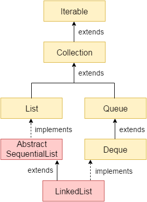

# Array List

## Jerarquía

## Caractéristicas principales

Operación | Comportamiento
--- | --- 
Mantiene el orden de inserción | Si
Permite elementos duplicados | Si
Ordena los elementos | No
Acepta elementos nulos | Si
Es Thread-Safe | No

## Complejidad Big-O

Operación | Complejidad
--- | --- 
Agregar | O(N)
Agregar al inicio | O(1)
Eliminar | O(N)
Obtener | O(N)
Contiene | O(N)
Obtener siguiente | O(1)

## Concurrencia

En caso de requerir **concurrencia**, se pueden utilizar lo siguiente:

- **Collections.synchronizedList** la cual retorna un ojeto **List** que es **Thread-Safe**.

## Implementación personalizada

- [Implementation Personalizada](CustomLinkedListImplementation.java)
- [Test cases](../../../../../../../../test/java/com/spcruzaley/topic/collections/list/linkedlist/CustomLinkedListImplementationTest.java)
